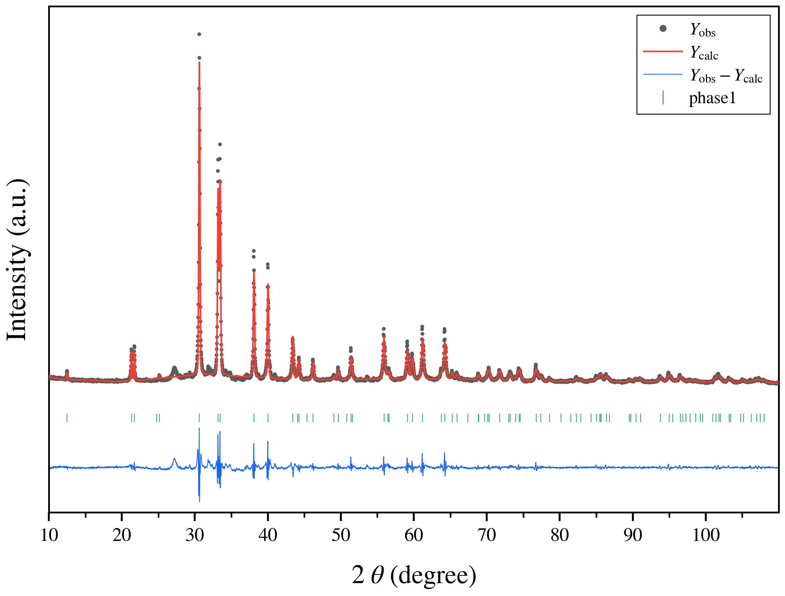

# XRD Rietveld Skills

Chinese | [English](#english)



## 中文

这是一个基于 **GSAS-II** 的 Codex skill，用于粉末 XRD 的 **Rietveld 精修**。  
它支持：

- 单相精修
- 多相精修
- GSAS-II 自动安装
- 逐参数精修
- 联合递增加参精修
- 择优取向精修
- 原子参数精修
- 阶段失败自动回退
- 导出最终结构参数、原子参数和拟合图

### 主要特性

1. 单相流程按固定顺序执行：
   - 背景 + Scale
   - `Zero`
   - `Cell`
   - `U`
   - `V`
   - `W`
   - `X`
   - `Y`
   - `SH/L`
   - `Size`
   - `Mustrain`
   - `背景 + 零点 + abc + U`
   - `... + V`
   - `... + W`
   - `... + U+V`
   - `... + U+W`
   - `... + V+W`
   - `... + U+V+W`
   - 择优取向
   - 原子坐标 / 热参数 / 占位 / 联合原子参数

2. 多相流程按相顺序执行：
   - 全局初始背景 + Scale
   - 相 1 完整执行单相流程
   - 相 2 完整执行单相流程
   - 相 3 完整执行单相流程
   - 最后执行全局收尾精修

3. 稳定性保护：
   - 每个阶段精修前会保存稳定检查点
   - 若该阶段导致 `Rwp` / `chi2` 明显变差或出现 `NaN`
   - 则自动回退到上一步稳定状态，并在 `final_summary.json` 中记录 `reverted`

4. 自动出图：
   - 黑色散点 `Yobs`
   - 红色曲线 `Ycalc`
   - 蓝色差谱 `Yobs - Ycalc`
   - 绿色或分彩色布拉格位置刻线
   - 适合论文或汇报风格的 Rietveld 图
   - README 示例图使用 `x1` 数据，图例相名显示为 `phase1`

### 仓库结构

```text
XRD_Rietveld_skills/
├─ README.md
├─ docs/
│  └─ example_multiphase_fit.png
└─ gsas2-xrd-refinement/
   ├─ SKILL.md
   ├─ agents/
   │  └─ openai.yaml
   ├─ references/
   │  └─ cli-examples.md
   └─ scripts/
      └─ refine_gsas2.py
```

### 安装方法

将仓库中的 `gsas2-xrd-refinement` 文件夹复制到你的 Codex skill 目录中，例如：

```powershell
Copy-Item -LiteralPath .\gsas2-xrd-refinement -Destination "$HOME\.codex\skills\" -Recurse -Force
```

或者直接克隆后手动放入：

```powershell
git clone https://github.com/kk154/XRD_Rietveld_skills.git
```

然后把：

```text
XRD_Rietveld_skills/gsas2-xrd-refinement
```

放到：

```text
~/.codex/skills/
```

### 使用前准备

- 已安装 Python
- 建议使用独立虚拟环境
- 有实验 XRD 数据文件：`.dat` / `.xy` / `.xye`
- 有一个或多个相对应的 `.cif`
- 若有实测 `.instprm`，建议优先使用

### 示例命令

#### 单相

```powershell
.\.venv-gsas2\Scripts\python.exe `
  C:\Users\15461\.codex\skills\gsas2-xrd-refinement\scripts\refine_gsas2.py `
  --pattern E:\work\sample\scan.dat `
  --cifs E:\work\sample\phase.cif `
  --output-dir E:\work\sample\gsas2_refinement
```

#### 多相

```powershell
.\.venv-gsas2\Scripts\python.exe `
  C:\Users\15461\.codex\skills\gsas2-xrd-refinement\scripts\refine_gsas2.py `
  --pattern E:\work\mix\scan.dat `
  --cifs E:\work\mix\phase_a.cif E:\work\mix\phase_b.cif E:\work\mix\phase_c.cif `
  --phase-names phase_a phase_b phase_c `
  --output-dir E:\work\mix\gsas2_refinement `
  --target-rwp 10 `
  --target-chi2 5
```

#### 指定自动安装 GSAS-II

```powershell
.\.venv-gsas2\Scripts\python.exe `
  C:\Users\15461\.codex\skills\gsas2-xrd-refinement\scripts\refine_gsas2.py `
  --pattern E:\work\sample\scan.dat `
  --cifs E:\work\sample\phase.cif `
  --gsasii-install-dir E:\tools\GSAS-II-src `
  --output-dir E:\work\sample\gsas2_refinement
```

### 输出文件

精修完成后会输出：

- `final_refinement.gpx`
- `final_fit.png`
- `final_curve.csv`
- `final_summary.json`
- `final_phase_parameters.csv`
- `final_atomic_parameters.csv`
- `prepared_pattern.xye`
- 各阶段的中间 `.gpx` / `.lst` / `.csv` / `.png`

### 适用场景

- 需要在 Codex 中自动执行 XRD 精修
- 需要稳定的单相 / 多相 GSAS-II 自动化流程
- 需要对联合参数开启顺序进行精细控制
- 需要失败阶段自动回退，避免最终结果被带崩

### 注意事项

- 如果 `Size`、`Mustrain`、择优取向或原子参数导致拟合发散，skill 会自动回退。
- 若想完全禁用某类精修，可使用：
  - `--disable-size-microstrain`
  - `--disable-preferred-orientation`
  - `--disable-atomic-refinement`
- 若本地没有 GSAS-II，可自动安装；若不想自动安装，可加：
  - `--no-auto-install-gsasii`

---

## English

This repository provides a **Codex skill** for **GSAS-II based powder XRD Rietveld refinement**.

It supports:

- single-phase refinement
- multiphase refinement
- automatic GSAS-II installation
- stepwise parameter refinement
- progressively expanded joint refinement
- preferred-orientation refinement
- atomic parameter refinement
- automatic rollback for unstable stages
- export of final structural, atomic, and plotting outputs

### Key Features

1. **Single-phase workflow**
   - background + scale
   - `Zero`
   - `Cell`
   - `U`
   - `V`
   - `W`
   - `X`
   - `Y`
   - `SH/L`
   - `Size`
   - `Mustrain`
   - `background + zero + cell + U`
   - `... + V`
   - `... + W`
   - `... + U+V`
   - `... + U+W`
   - `... + V+W`
   - `... + U+V+W`
   - preferred orientation
   - atomic coordinates / displacement / occupancy / combined atomic refinement

2. **Multiphase workflow**
   - global initial background + scale
   - phase 1 full single-phase workflow
   - phase 2 full single-phase workflow
   - phase 3 full single-phase workflow
   - final global cleanup refinement

3. **Stability protection**
   - a stable checkpoint is saved before every trial stage
   - if a stage causes worse `Rwp`, worse `chi2`, or non-finite values
   - the project is reverted automatically and the failed trial is recorded in `final_summary.json`

4. **Publication-style plotting**
   - black `Yobs` markers
   - red `Ycalc` line
   - blue `Yobs - Ycalc` difference curve
   - Bragg-position tick marks
   - Rietveld-style layout suitable for reports and manuscripts
   - the README example uses the `x1` single-phase pattern and shows the phase label as `phase1`

### Repository Layout

```text
XRD_Rietveld_skills/
├─ README.md
├─ docs/
│  └─ example_multiphase_fit.png
└─ gsas2-xrd-refinement/
   ├─ SKILL.md
   ├─ agents/
   │  └─ openai.yaml
   ├─ references/
   │  └─ cli-examples.md
   └─ scripts/
      └─ refine_gsas2.py
```

### Installation

Copy the `gsas2-xrd-refinement` folder into your Codex skills directory:

```powershell
Copy-Item -LiteralPath .\gsas2-xrd-refinement -Destination "$HOME\.codex\skills\" -Recurse -Force
```

Or clone the repository first:

```powershell
git clone https://github.com/kk154/XRD_Rietveld_skills.git
```

Then place:

```text
XRD_Rietveld_skills/gsas2-xrd-refinement
```

into:

```text
~/.codex/skills/
```

### Requirements

- Python installed
- preferably a dedicated virtual environment
- experimental XRD pattern files: `.dat`, `.xy`, or `.xye`
- one or more matching `.cif` phase files
- a measured `.instprm` file if available

### Example Commands

#### Single phase

```powershell
.\.venv-gsas2\Scripts\python.exe `
  C:\Users\15461\.codex\skills\gsas2-xrd-refinement\scripts\refine_gsas2.py `
  --pattern E:\work\sample\scan.dat `
  --cifs E:\work\sample\phase.cif `
  --output-dir E:\work\sample\gsas2_refinement
```

#### Multiphase

```powershell
.\.venv-gsas2\Scripts\python.exe `
  C:\Users\15461\.codex\skills\gsas2-xrd-refinement\scripts\refine_gsas2.py `
  --pattern E:\work\mix\scan.dat `
  --cifs E:\work\mix\phase_a.cif E:\work\mix\phase_b.cif E:\work\mix\phase_c.cif `
  --phase-names phase_a phase_b phase_c `
  --output-dir E:\work\mix\gsas2_refinement `
  --target-rwp 10 `
  --target-chi2 5
```

### Outputs

The workflow generates:

- `final_refinement.gpx`
- `final_fit.png`
- `final_curve.csv`
- `final_summary.json`
- `final_phase_parameters.csv`
- `final_atomic_parameters.csv`
- `prepared_pattern.xye`
- stage-by-stage `.gpx`, `.lst`, `.csv`, and `.png` snapshots

### Practical Notes

- If `Size`, `Mustrain`, preferred orientation, or atomic refinement destabilizes the fit, the skill rolls back automatically.
- To disable selected refinement families:
  - `--disable-size-microstrain`
  - `--disable-preferred-orientation`
  - `--disable-atomic-refinement`
- To prevent automatic GSAS-II installation:
  - `--no-auto-install-gsasii`

### License

This repository keeps the existing upstream repository license file. Please review `LICENSE` before redistribution or reuse.
